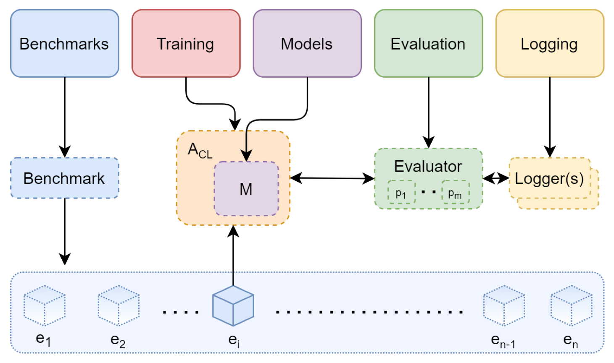

    
## AI-powered edge devices: Generative Replay for Continual Learning

Repository that is intended to keep track of the work for the project of the course Embedded Systems and that contains all the reference material and the scripts developed to this end.

### PROJECT in two lines
The presented work aims at providing interesting improvements to replay and memory-based approaches that store past data to alleviate catastrophic forgetting in the field of **Continual Learning**, by performing extensive experimental evaluation on the novel framework of **Generative Replay**. 

I propose an alternative approach to sequentially train NNs without referring to past data. In this generative replay framework in fact, the model retains previously acquired knowledge by training a deep generative model to mimic past data to be paired with corresponding response from the past task solver to represent old tasks.

The model can be applied to **any** task as long as the trained generator reliably reproduces the input space.

References                                              | link         
--------------------------------------------------------|---------------------------------
Continual Learning with Deep Generative Replay          | https://arxiv.org/abs/1705.08690
Brain-inspired replay for Continual Learning            | https://www.nature.com/articles/s41467-020-17866-2
An introduction to Variational Autoencoders             | https://arxiv.org/abs/1906.02691

**In the context of AI-powered edge devices**, this work also reports the trade-off between memory footprint, latency, and accuracy for learning a new class with Generative Replay when targeting an image classification task on the MNIST dataset; Memory and computational requirements of the Continual Learning algorithm are first quantified and later evaluated in a simulated environment but from a platform-perspective:
- Memory evaluation
- Latency
- Accuracy
- Energy estimation

References                                             | link         
-------------------------------------------------------|---------------------------------
Continual Learning on a RISC-V Node                    | https://arxiv.org/abs/2007.13631
An investigation of Generative Replay in DRL           | http://essay.utwente.nl/85772/

***

### Avalanche - *end-to-end library for Continual Learning*
Open-source end-to-end library for continual learning based on Pytorch, devised to ease the implementation, assessment and replication of continual learning algorithms across different settings.

  
**[Avalanche Website](https://avalanche.continualai.org)**

All the code is based on the `Avalanche` framework and is publicy available.
***

## Action plan

### 1. EXPERIMENT
Provide a set of experiments reproducing **Generative Replay strategy** in Continual Learning.  
Jupyter Notebook scripts are (so far) organized as follows:
 - *Generative Model*: Variational AutoEncoder (VAE) 
   - *GenerativeModel.ipynb* defines the VAE generative model of data;
 - *Generator Strategy*
   - *Generator.ipynb* wraps the VAE generator in a trainable strategy, serves as simulative training of the generator for the Scholar model;
 - *Training Strategy*: Generative Replay 
   - *GenerativeReplay.ipynb* implements the Continual Learning strategy of Deep Generative Replay.
   
### 2. EVALUATE

Bechmark and evaluate the performance together with the computational and memory requirements of the Continual Learning strategy:
- **Task protocol**
  - Split-MNIST, split up the MNIST dataset in five tasks, such that each task contains two digits.
- **Network architecture**
  - Fully connected network with two hidden layers of 400 nodes each with ReLU non-linearities and a softmax output layer. The softmax output layer is single-headed, meaning that only all output units of the classes encountered so far are active.
- **Training**
  - Two models sequentially trained on all tasks: the main model, for actually solving the task and a generative model, for generating replays of previously learned tasks. The data to be replayed is produced by first sampling inputs from the generative model, after which those generated inputs are presented to the main model and labelled as the most likely class as predicted by that model.
- **Evaluation on a MCU-class architecture perspective**
  - Accuracy;
  - Confusion matrices to assess the quality of the patterns seen during training;
  - ... to be completed ...
### 3. DISCUSSION
Discuss the results and conclude.
