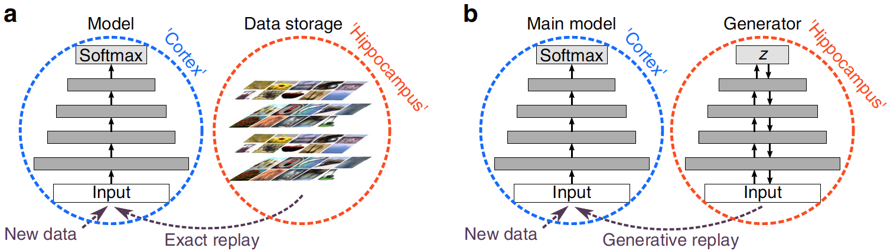
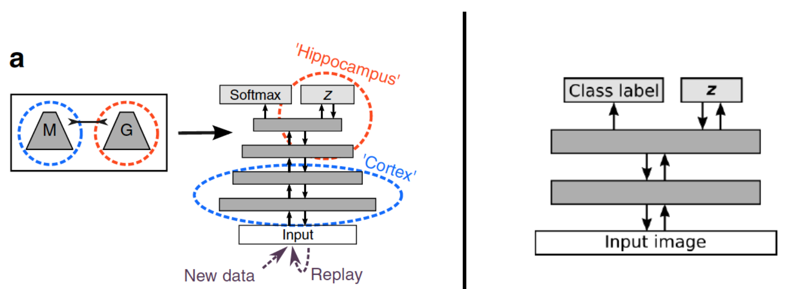
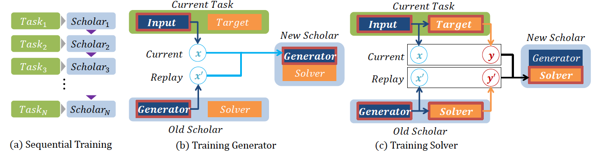

## Description

### INTRO
**Deep generative replay framework** that generates fake inputs from learned past input distribution to retain knowledge without revisiting actual past data. The network in fact is jointly optimized using an ensemble of generated past data and real current data.

The generative replay strategy implemented relies on the framework proposed by [Shin et al.](https://arxiv.org/abs/1705.08690?context=cs), which consists of a main model for solving the tasks and a separate generative model trained to generate the data to be replayed:

### 1. Generative Model
Hereby it is considered a variational autoencoder deep generative model based on a fully connected neural network that is able to mimic complex samples like images. The term generative model refers to any model that generates observable samples.

**The Variational AutoEncoder (VAE)** is an architecture composed of an encoder, a decoder and a loss function, that is trained to minimize the reconstruction error between the encoded-decoded data and the initial data:

 

The VAE is symmetric, the architectures are similar to the base neural network: both the encoder and the decoder are fully connected NNs with two hidden layers containing 400 units with ReLU non-linearity. To train the generator, the same hyperparameters (optimizer, batch sizes, learning rate) are used as for training the main model.

Reference script: *GenerativeModel.py*. Any kind of generative model can be used, the script utilizes a VAE generator.  
Performance depend on the quality of the generator and its ability to recover the input distribution.

### 2. Generator
The **Generator** for the scholar model is wrapped into a trainable strategy, to be passed to the generator_strategy parameter when using Generative Replay plugin of Avalanche. The data to be replayed is produced by first sampling the inputs from the generative model, whereafter those generated inputs are presented to the main model.

Taking inspiration from ref. [1](https://arxiv.org/abs/1809.10635) and [2](https://www.nature.com/articles/s41467-020-17866-2), the standard Generative Replay approach is proposed with the **Replay-through-feedback** modification: the generator is merged into the main model by equipping it with generative feedback connections; the first layers of the resulting model can be interpreted as the early layers of the visual cortex and the top layers as corresponding to the hippocampus:

The replay through feedback model is implemented as a symmetric VAE, as described before, with an additional softmax classification layer from the final hidden layer of its encoder. This way, the computational cost is much reduced.

Reference script: *Generator.py*. Script serves as a test to visualize the samples generated by the VAE generative model.

### 3. Training strategies
Instances of the **training strategies** for the VAE generative model and Generative Replay, based on the SupervisedTemplate of Avalanche, which is a basic training loop and callback system that allows to execute code at each experience of the training loop.

Reference script: *TrainingStrategies.py*. **(to be completed..)**

### 4. Generative Replay
Experiment reproducing Generative Replay strategy: Deep Generative Replay for a Scholar consisting of a Solver and Generator. 
The strategy relies on the *GenerativeReplayPlugin* of Avalanche. 

 

The scholar model is built with a solver that has suitable architecture for solving a task sequence and a generator trained using a variational autoencoder. However, this framework can employ any deep generative model as a generator.

Reference script: *GenerativeReplay.py*. **(to be completed..)**
